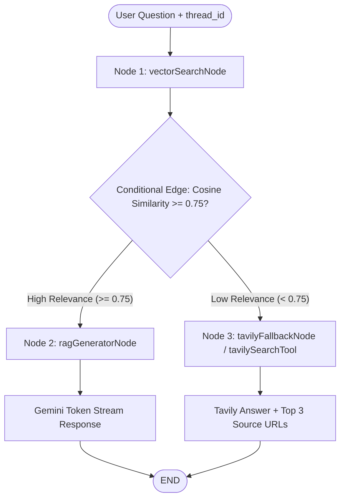

# AI Chat with YouTube Videos (LangGraph RAG + Pinecone)

[](LICENSE)
[](https://nextjs.org/)
[](https://js.langchain.com/docs/langgraph)
[](https://www.pinecone.io/)

A fullstack RAG-powered application that enables users to input any YouTube video link (e.g. `youtube.com/watch?v=...`, `youtu.be/...`) and chat naturally with its transcript using Google Gemini models, Pinecone Cloud Vector similarity search (3072 dimensions), and an automated Tavily Web Search tool fallback when similarity is below **0.75**.

---

## 🌟 Key Features

- **LangGraph Ingestion Subgraph (`ingestGraph.ts`)**: Structured multi-node ingestion pipeline (`extract_video_id` $\rightarrow$ `fetch_transcript` $\rightarrow$ `chunk_and_embed` $\rightarrow$ `upsert_pinecone`) executed via state graph workflows.
- **Universal YouTube Transcript Parsing**: Supadata API integration for reliable, cloudless transcript parsing and chunking.
- **Pinecone Vector DB (3072 Dimensions)**: Stores and indexes text chunk embeddings generated by Google Gemini (`gemini-embedding-001` with 3072 dimensions) with batched upserts.
- **LangGraph Stateful Graph Workflow**:
  - Uses `addConditionalEdges` to route queries based on cosine similarity scores ($\ge 0.75 \rightarrow$ Gemini RAG, $< 0.75 \rightarrow$ Tavily Fallback).
  - Robust serverless cold-start resilience: recovers `videoId` state from `thread_id` (`thread_${videoId}_${timestamp}`) across Vercel instances.
  - Exposes graph state checkpoints via `GET /api/chat?threadId=...` using `graph.getState()`.
  - Employs exponential backoff & jitter node retry policies.
  - Streams answers token-by-token with `streamEvents()`.
- **Tool Calling Web Search Fallback**: Web search is integrated as a formal LangChain Tool (`tavilySearchTool`). When video relevance is $< 0.75$, Tavily returns direct web answers along with top 3 source URLs.
- **daisyUI & Tailwind CSS UI**: Built with modern dark/light UI components, embedded YouTube player, and responsive chat interface.

---

## 📊 LangGraph Architecture Diagrams

### 1. Main Chat & RAG Graph Workflow



### 2. Ingestion Subgraph (`ingestGraph.ts`)

```mermaid
flowchart LR
    StartIngest([YouTube URL]) --> ExtractID[extract_video_id Node]
    ExtractID --> FetchTranscript[fetch_transcript Node]
    FetchTranscript --> IngestVectorstore[ingest_vectorstore Node]
    IngestVectorstore --> BatchedUpsert[Pinecone Batched Upsert (3072 Dims)]
    BatchedUpsert --> EndIngest([Completed Subgraph])
```

---

## 🛠️ Tech Stack & Prerequisites

- **Frontend & Backend**: Next.js 16 (App Router, TypeScript, Tailwind CSS v4, daisyUI)
- **AI Orchestration**: LangGraph JS (`@langchain/langgraph`), LangChain Core (`@langchain/core`)
- **LLM & Embeddings**: Google Gemini 3.6 Flash & `gemini-embedding-001` (3072 dimensions)
- **Vector Storage**: Pinecone Cloud Vector DB (`@pinecone-database/pinecone`)
- **Web Search Tool**: Tavily API (`@tavily/core`, `@langchain/core/tools`)
- **Transcript Extraction**: Supadata API (`@supadata/js`)

---

## ⚙️ Environment Setup

1. **Clone the repository**:

   ```bash
   git clone https://github.com/extrawest/chat_with_youtube_videos.git
   cd chat_with_youtube_videos
   ```

2. **Copy environment variables file**:

   ```bash
   cp .env.example .env.local
   ```

3. **Create Pinecone Index**:
   - Log in at [pinecone.io](https://www.pinecone.io/)
   - Create Index: `youtube-transcripts`
   - Metric: `cosine`
   - Dimensions: `3072`

4. **Configure your `.env.local`**:

   ```env
   GEMINI_API_KEY=your_google_gemini_api_key
   TAVILY_API_KEY=your_tavily_api_key
   PINECONE_API_KEY=your_pinecone_api_key
   PINECONE_INDEX_NAME=youtube-transcripts
   SUPADATA_API_KEY=your_supadata_api_key
   ```

5. **Install dependencies & run development server**:

   ```bash
   pnpm install
   pnpm dev
   ```

6. Open [http://localhost:3000](http://localhost:3000) in your browser.

---

## 💡 Git Author Configuration Guidelines

When contributing to work or team repositories, verify your Git commit identity matches your company/work GitHub account:

```bash
# Check current author info
git config user.name
git config user.email

# Set correct work identity for this repository
git config user.name "Your Name"
git config user.email "your.work.email@company.com"
```

To update author attribution on recent local commits:

```bash
git commit --amend --author="Your Name <your.work.email@company.com>" --no-edit
```

---

## 📄 License

Copyright 2026 Extrawest

Licensed under the Apache License, Version 2.0 (the "License");
you may not use this file except in compliance with the License.
You may obtain a copy of the License at

    http://www.apache.org/licenses/LICENSE-2.0

Unless required by applicable law or agreed to in writing, software
distributed under the License is distributed on an "AS IS" BASIS,
WITHOUT WARRANTIES OR CONDITIONS OF ANY KIND, either express or implied.
See the License for the specific language governing permissions and
limitations under the License.
