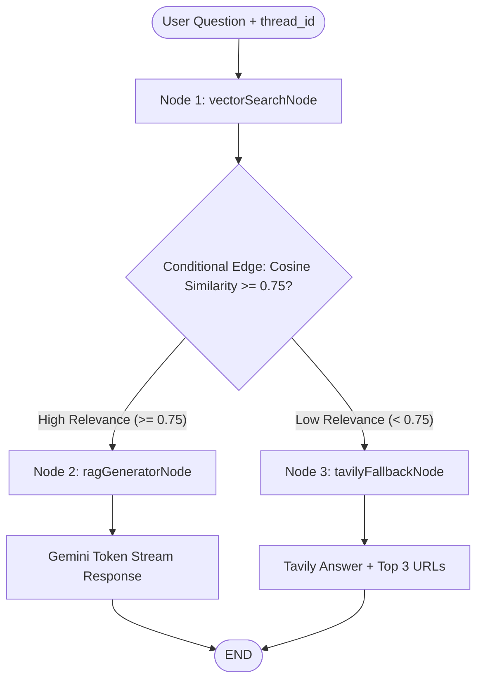

# AI Chat with YouTube Videos (LangGraph RAG + Pinecone)

[](LICENSE)
[](https://nextjs.org/)
[](https://js.langchain.com/docs/langgraph)
[](https://www.pinecone.io/)

A fullstack RAG-powered application that enables users to input any YouTube video link (e.g. `youtube.com/watch?v=...`, `youtu.be/...`) and chat naturally with its transcript using Google Gemini models, Pinecone Cloud Vector similarity search, and an automated Tavily Web Search fallback when similarity is below **0.75**.

---

## Video demostration

https://github.com/user-attachments/assets/4b419ad1-a849-414f-9139-4d1945f3ecbf

---

## 🌟 Key Features

- **Universal YouTube Transcript Parsing**: Automatically fetches and chunks video transcripts for any public YouTube video link.
- **Pinecone Cloud Vector Database**: Stores and indexes text chunk embeddings generated by Google Gemini (`text-embedding-004`).
- **LangGraph Stateful Graph Workflow**:
  - Uses `addConditionalEdges` to route queries based on cosine similarity scores ($\ge 0.75 \rightarrow$ Gemini RAG, $< 0.75 \rightarrow$ Tavily Fallback).
  - Maintains conversation history via persistent `MemorySaver` checkpointer and `thread_id`.
  - Employs exponential backoff & jitter node retry policies.
  - Streams answers token-by-token with `streamEvents()`.
- **Automatic Tavily Web Search Fallback**: When video relevance is low or the question is outside the video context, Tavily returns direct web answers along with top 3 source URLs.
- **daisyUI & Tailwind CSS UI**: Built with modern dark/light UI components, embedded YouTube player, and quick prompt chips.

---

## 📊 LangGraph Workflow Diagram



---

## 🛠️ Tech Stack & Prerequisites

- **Frontend & Backend**: Next.js 15 (App Router, TypeScript, Tailwind CSS v4, daisyUI)
- **AI Orchestration**: LangGraph JS (`@langchain/langgraph`), LangChain Core
- **LLM & Embeddings**: Google Gemini 1.5 Flash (`@langchain/google-genai`), `text-embedding-004`
- **Vector Storage**: Pinecone Cloud Vector DB (`@langchain/pinecone`, `@pinecone-database/pinecone`)
- **Web Search**: Tavily API (`@tavily/core`)
- **State Checkpointing**: `MemorySaver` (`@langchain/langgraph`)

---

## ⚙️ Environment Setup

1. **Clone the repository**:
   ```bash
   git clone https://github.com/extrawest/chat_with_youtube_videos.git
   cd chat_with_youtube_videos
   ```

2. **Copy environment variables file**:
   ```bash
   cp .env.example .env.local
   ```

3. **Create Pinecone Index**:
   - Log in at [pinecone.io](https://www.pinecone.io/)
   - Create Index: `youtube-transcripts`
   - Metric: `cosine`
   - Dimensions: `768`

4. **Configure your `.env.local`**:
   ```env
   GEMINI_API_KEY=your_google_gemini_api_key
   TAVILY_API_KEY=your_tavily_api_key
   PINECONE_API_KEY=your_pinecone_api_key
   PINECONE_INDEX_NAME=youtube-transcripts
   ```

5. **Install dependencies & run development server**:
   ```bash
   pnpm install
   pnpm dev
   ```

6. Open [http://localhost:3000](http://localhost:3000) in your browser.

---

## 🧪 Testing with Recommended Video

Test the solution using the official benchmark video:
- **Test URL**: `https://www.youtube.com/watch?v=U9mJuUkhUzk`

---

## 📄 License

Copyright 2026 Extrawest

Licensed under the Apache License, Version 2.0 (the "License");
you may not use this file except in compliance with the License.
You may obtain a copy of the License at

    http://www.apache.org/licenses/LICENSE-2.0

Unless required by applicable law or agreed to in writing, software
distributed under the License is distributed on an "AS IS" BASIS,
WITHOUT WARRANTIES OR CONDITIONS OF ANY KIND, either express or implied.
See the License for the specific language governing permissions and
limitations under the License.
